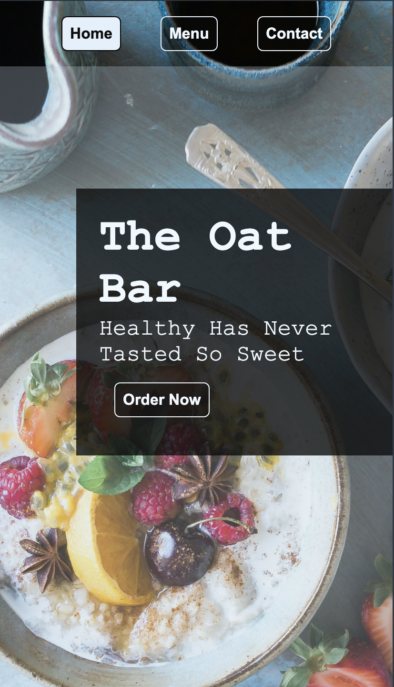
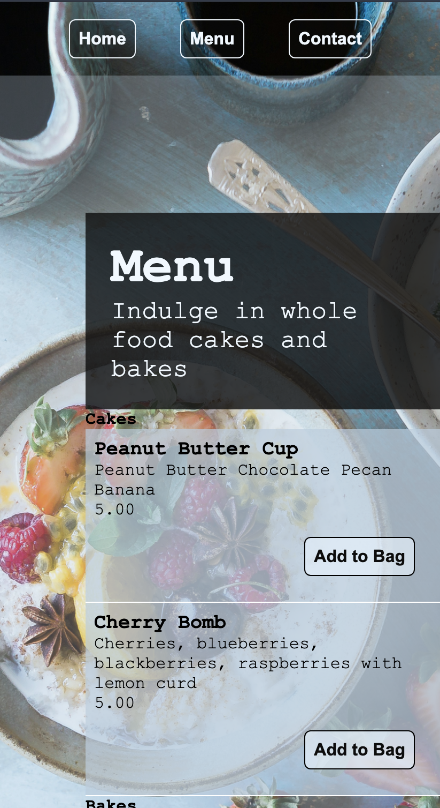

# odin-restaurant
The Odin Project: Restaurant page

Welcome to The Oat Bar, a grab-and-go healthy breakfast place serving all things oats.

Check it out! link here

## Model 
### Landing Page
|  Desktop | Mobile   | 
|----------|----------|
| ||

### Menu Page

|  Desktop | Mobile   | 
|----------|----------|
| ||

### About Page

|  Desktop | Mobile   |
|----------|----------|
| ||

## Skills
- HTML
- CSS
- JavaScript
- NPM
- Webpack

## Lessons
NPM
- software registry: contains open-source code packages
- package manager: tracks package versions and facillitates dependency installations (package installations needed for code to work) which are defined in package.json

Webpack
- Bundler: takes entry point file and creates dependency graph needed to generate a single output html file. A bundler improves browser compatibility, performance (reduces requests), and ensure dependencies are included in output.
- Entry/Output: source, /src/index.js and /dist/main.js
- Configuration: webpack.config.js file w html-webpack-plugin

.gitignore
- .gitignore to ignore node_modules when committing to github

Host completed pages on GitHub
- deploy dist subdirectory to GitHub pages

Pages with modules